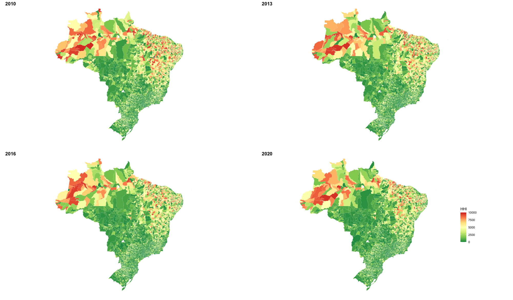

# Mestrado USP

 

### Projeto de dissertação - Concentração no Mercado de Trabalho

O impacto de salários para trabalhadores é um dos objetos de pesquisa econômica e são pesquisas ativas pela popularização de estudos do poder de monopsônio das empresas sobre o mercado de trabalho. Nesse trabalho busco trazer luz a fatos estilizados teóricos de acordo com dados do Brasil, além de buscar impactos da concentração no mercado de trabalho dentro das especifidades do Brasil.

Assim, utilizo uma medida construída por Herfindahl-Hirschman Index (HHI) para Concentração no Mercado de Trabalho utilizando os dados da RAIS e comparando com dados do CENSO. Para entender os limites das definições para mercados concentrados, note que um mercado com quatro firmas e com frações de mercado iguais tem um HHI igual a 2500.

Calculei durante o período de 2020-2010 no qual obtive informação de concentração para 5564 municípios. Em 2020, na média, os mercados de trabalho por microrregiões não são altamente concentrados: o HHI médio é 2433, no qual equivale a 4.11 firmas contratantes com participação igual no mercado do total de vínculos ativos registrados.

## Resultados

Primeiro, consegui estimar uma elasticidade negativa de 8,6% entre Salários e Concentração de Mercado. Segundo, quando adicionei controle de tamanho do setor informal no mercado de trabalho, a relação negativa se manteve. Por fim, o resultado mais interessante ocorreu quando multipliquei os dois regressores e obtive uma relação positiva, que comprova uma "outside option" para trabalhadores que não estão no setor formal e, por isso, procuram oportunidades fora do mercado de trabalho formal.

## Extensões

Os arquivos possuem extensões do modelo básico em que considerei outros controles do município como gênero, tamanho do munícipio, IDH e outros. Além disso, construí uma medida alternativa de concentração do mercado de trabalho com informalidade endógena e mostro que os resultados iniciais se mantém.

